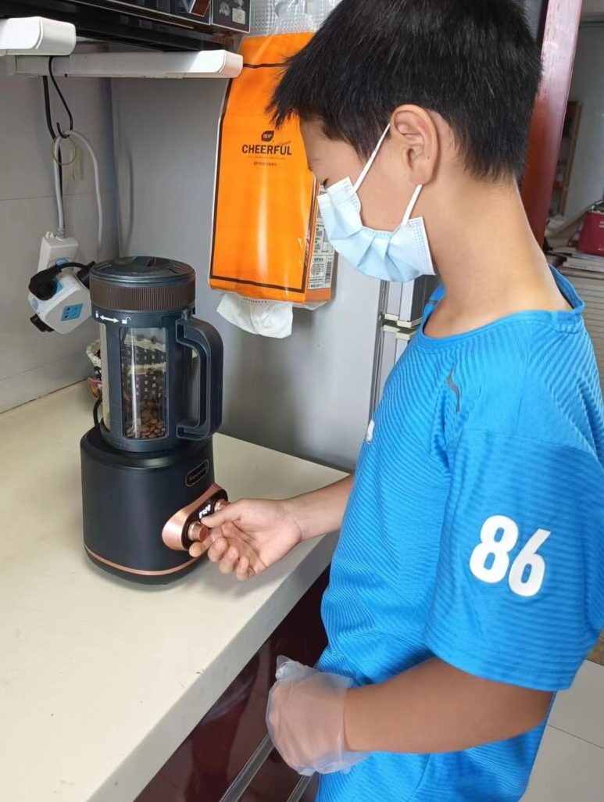
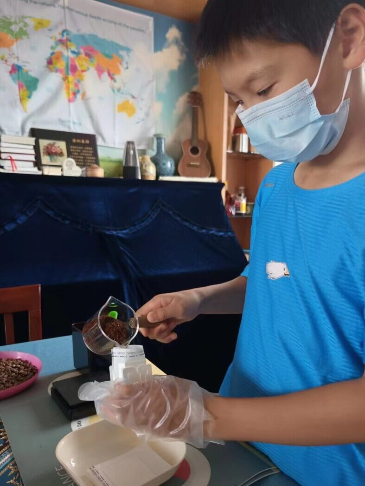
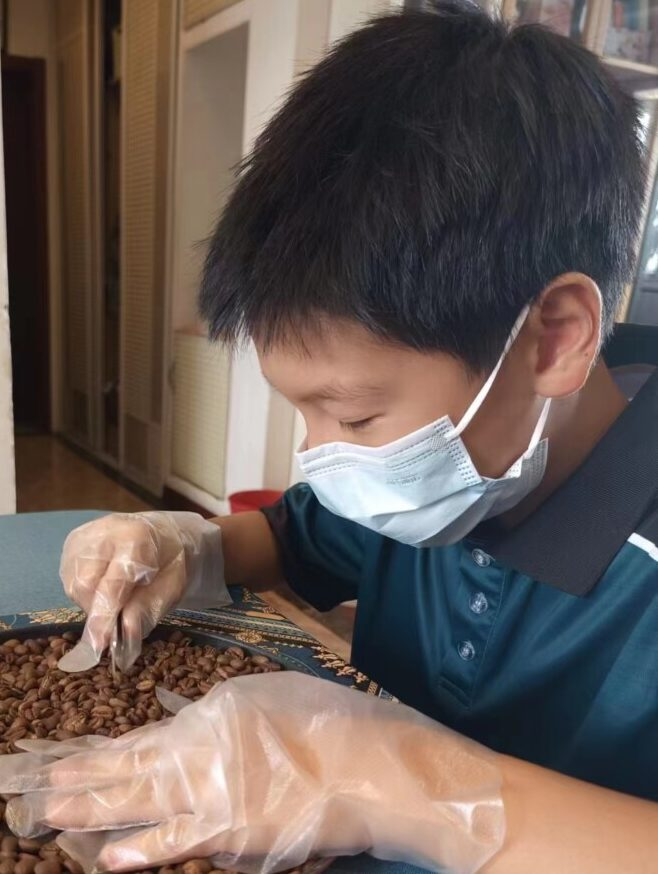

暑假里（2024年）儿子要出去比赛，需要一笔路费。虽说我们尚有能力直接支持他，但想着鼓励儿子勤工俭学，筹集路费。于是我们尝试着让儿子开始一个新的项目，做挂耳咖啡。

之所以选择咖啡，是因为我这做老爸的喜欢喝咖啡。平时喝的咖啡都是自己烤的，积累了两三年的经验。如今也可以拿来用一下。

儿子叫恩言，刚出生的女儿叫颂言。所以，我们给咖啡起名叫恩颂咖啡。我寻思着兄妹俩将来也许能一起经营他们的品牌。

说是勤工俭学，筹集路费，其实我是想带着儿子一起学习生产、经营。这本来就是我为儿女设计的教育内容中的一部分。儿子11岁，虽然有些幼稚，但应该可以学着做些事了。希望透过这个经营项目，儿子能够学会各种管理和服务的技能。这“恩颂咖啡”若是用心经营，做上10年，也许真能成为他们将来的产业。

教导孩子从小学习亲手劳力，经营正经事业，这是犹太教育的特色之一。对此我非常认同。作为一个基督徒的父亲，我希望教会儿女依靠上帝的信仰生活，其中包括几件事。第一，学会自己从圣经中寻求信仰；第二，学会管理自己的生活；第三，学会亲手做正经事；第四，学会建立一个家庭，教养敬虔的儿女。

至于要不要读大学，这是其次的事情。如果他对某个学问感兴趣，可以自己赚钱，去读书。

我自己做了10多年牧师。起初儿子以为我会希望他做牧师。许多人也是这么以为的。但我从来没有勉强他要做牧师的想法。这倒不是因为我嫌作牧师太清苦。我认为牧师、传道根本不应该是一种职业。所以不存在子承父业的问题。

我当然期待儿子将来能成为福音工人，带领门徒，建立教会。但这不应该是他的职业，而应该是他生命的自然发展过程。我希望他能够经营好一门自食其力的生意，又能教导圣经，带领门徒。就像保罗那样的服侍（保罗应该是从小学习编织帐篷的）。事实上，职业牧师是后来发展出来的现象。耶稣的时代，大多数拉比都是自食其力的，而非靠教导圣经谋生。

回到教育的话题，我认为现代教育的最大困局之一是，教育与实际生活严重脱节。一方面，几乎所有的人寻求教育的目的是为了将来就业。但另一方面，学校并没有教学生如何从事具体的生产劳动和经营。大学毕业生几乎什么都不会。进入企业一切都要从头开始学。

多数人以为从小学到大学是必经的教育过程。其实说白了就是想要一张文凭，可以找工作。但实际上，学历与学识根本不能等同。结果是花了十几年在学校中，结果既没有学识，又没有实际能力。

我觉得没有学历并不影响谋生。不能就业，可以创业。许多人质疑创业难。其实不是因为创业难，而是因为从小到大从来没有学过经营生意。

所以，我认为小孩子应该从小参与生产、经营活动。这是他们的必修课之一。学习这些的目的不是为了做生意，发大财，而是为了能够“亲手作正经事，就可有余，分给那缺少的人。” (弗 4:28)

今年是恩颂咖啡的小小起步。我们并不指望现在能供应生活。但若主许可，能够长期经营。我想这是我能留给孩子的宝贵产业，第一是信仰，第二是学习亲手做正经事。

