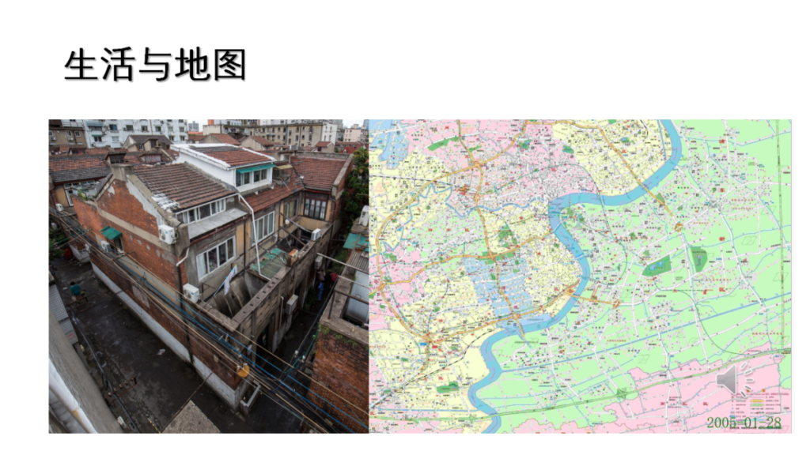
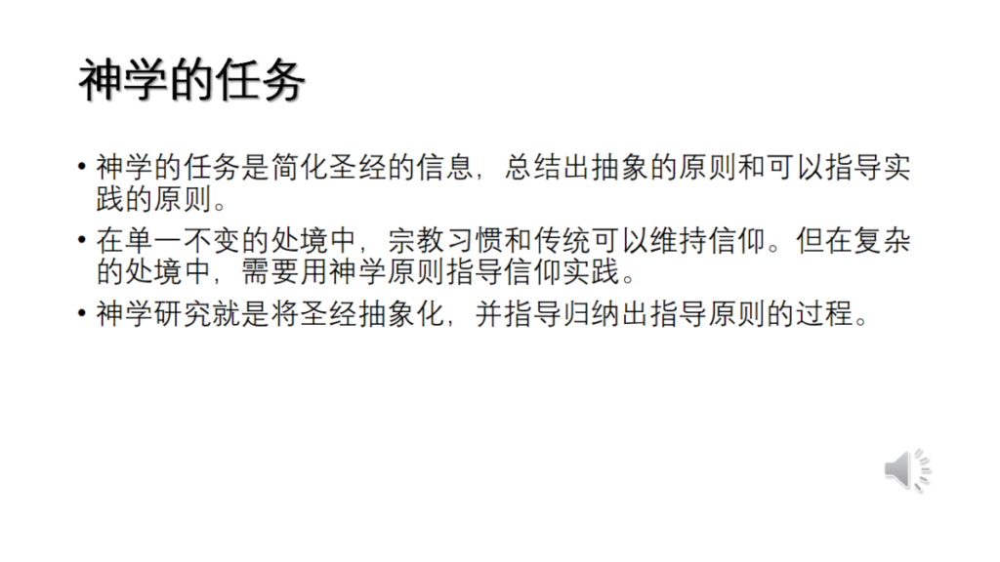
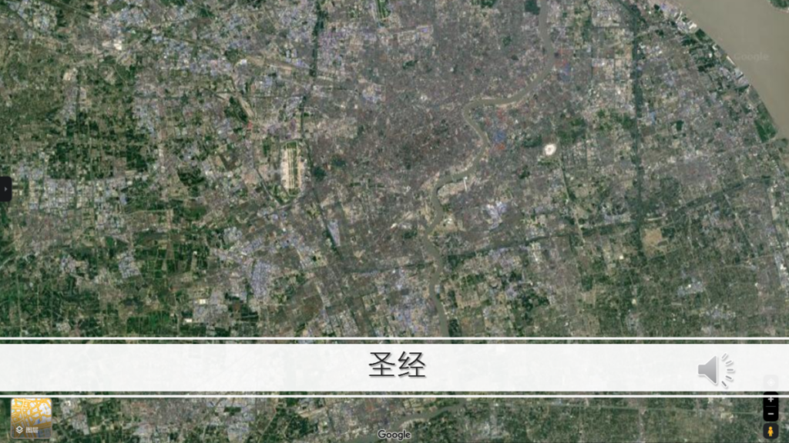
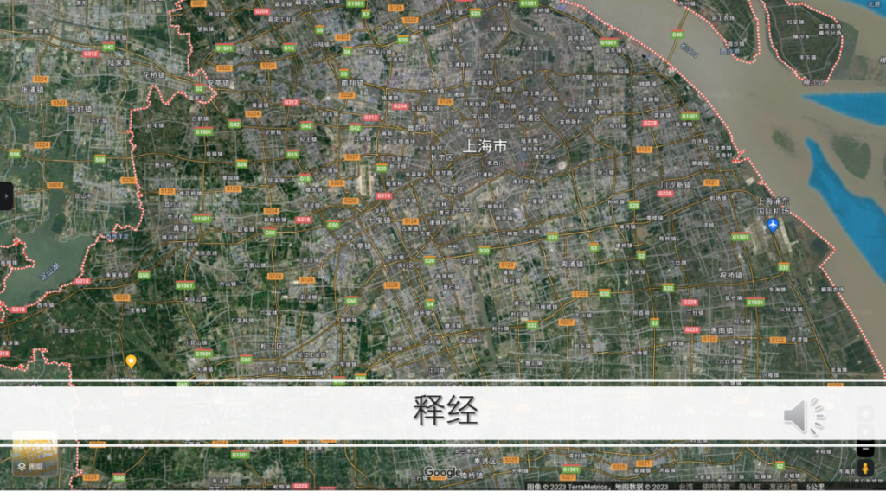
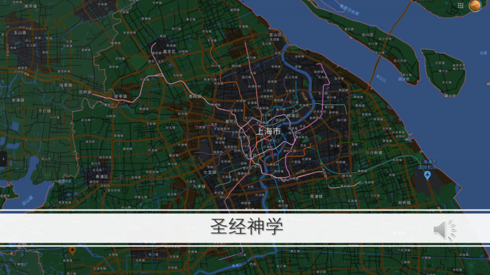
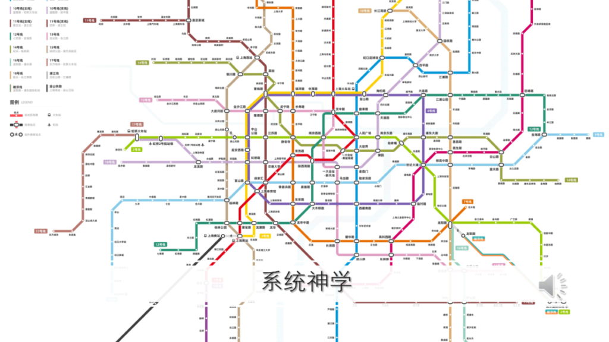
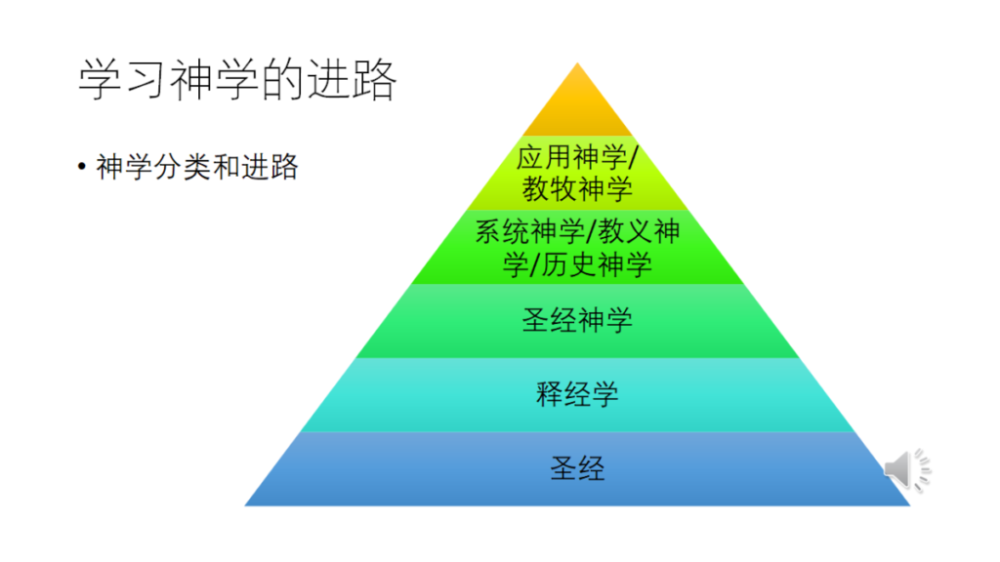

<audio controls preload="none" src="https://pub-2d60f2a9cf864ffe917b720934715757.r2.dev/6732_____________.mp3"></audio>

原始链接 [点击](https://gracehouseedu-my.sharepoint.com/:v:/g/personal/brianinchrist_gracehouseedu_onmicrosoft_com/EXOUwlSkOddEmYXFgCa-KIMBN3U5YWCsI9OpdWT5-AcITQ?e=gzXXx7)

<video controls src="https://pub-2d60f2a9cf864ffe917b720934715757.r2.dev/6732_____________.mp4"></video>

