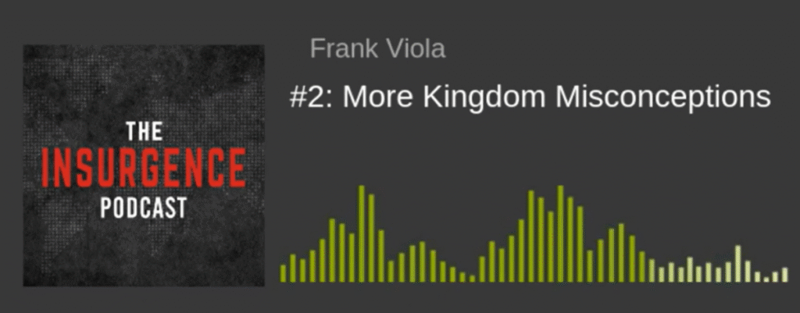

<video controls src="https://pub-2d60f2a9cf864ffe917b720934715757.r2.dev/8063_____________.mp4"></video>

### 简介：为何这两个概念至关重要

对于一个渴望深入理解信仰的信徒而言，掌握“世界体系”与“神的国度”这两个相互对立的概念，是一次具有启示性的关键一步。这不只是学习两个神学术语，而是要看清两套截然不同的操作系统，它们支配着截然不同的价值观、忠诚对象和生活方式。

本文旨在以简单易懂的语言，清晰地定义这两个术语，揭示它们在价值观和结构上的根本区别，并阐明信徒蒙召，是要作为一种“另类文明”而活——既不与社会完全隔绝，又不被其价值观所同化。

让我们首先深入探究那个无所不在却又常常被误解的“世界体系”。

——————————————————————————–

### 第一部分：解构“世界体系” (Cosmos)

**什么是世界体系？**

当圣经提到“世界”（希腊语为 *cosmos*）时，它通常不是指我们脚下的地球，也不是指世上所有的人。它主要指的是一个由撒但所掌控的、相互关联的、有组织的系统。这是一个由无数子系统环环相扣、层层嵌套而成的庞大体系（a system of systems of systems）。

这个体系有几个显著的特征：

- **等级森严的结构：** 它的核心结构是一个金字塔式的、自上而下的控制体系，其本质是压迫性的。
- **无形的统治者：** 这个体系的最高统治者是撒但。圣经明确指出他是“这世界的神”（哥林多后书 4:4）和“这世界的王”。一个最具说服力的证据，来自撒但在旷野中对耶稣的试探：他将“世上的万国”都指给耶稣看，声称这些国度都属于他，他可以随意赐给谁。值得注意的是，耶稣从未反驳过撒但对其所有权的主张。
- **包含的领域：** 它包含了人类社会的方方面面，其中**政治体系**是其重要组成部分。

因此，当一个信徒接受洗礼时，其深层含义之一便是公开宣告与这个“世界体系”决裂。这是一场忠诚的革命，将自己的效忠对象，从这个体系的无形统治者彻底转移到一位新的君王身上。

看清了这个由黑暗权势所操控的体系之后，让我们将目光转向那个充满希望与光明的国度。

——————————————————————————–

### 第二部分：拥抱“神的国度”

**什么是神的国度？**

“神的国度”其核心理念非常简单：承认神为至高的王，并尊耶稣基督为其君王。然而，这个国度在世上的体现方式，却常常被误解。

它不是指一座富丽堂皇的建筑物，也不是指每周一次的宗教仪式。神的国度具体地体现在祂的子民——那些被称为 *ekklesia*（教会）的、面对面的共同体之中。在今天的世界上，如果你想找到神的国度，你就要去寻找耶稣所在的地方——那就是祂的身体，是信徒的共同体。这些共同体就是国度在地上有形的、此时此地的表达。

这个国度的目的和模式，可以从旧约的以色列身上找到雏形：

1. **成为独特的见证** 神的国度被呼召成为一个“另类文明”（alternative civilization）。它拥有与世界体系截然不同的文化、价值观和效忠对象。其目标，是要向周围的世界生动地展示：当神亲自作王时，人类社会将是何等景象。这正如神呼召以色列成为一个圣洁、独特的国度，作为万国的见证一样。
2. **成为世界的光** 这个“另类文明”并非要通过世界的手段（如政治渗透或武力征服）去改造世界。相反，当国度的子民们活出一种彼此相爱的共同体生活时，他们的影响力会自然而然地渗透到周围的文化中，成为一个活生生的见证和光芒。

为了更清晰地理解这两者，让我们将它们并列进行直接比较。

——————————————————————————–

### 第三部分：核心差异：一目了然的对比

下表清晰地展示了“世界体系”与“神的国度”之间的根本区别：

| 特征 | 世界体系 | 神的国度 |
| --- | --- | --- |
| **最高统治者** | 撒但（“这世界的神”、“这世界的王”） | 神/耶稣基督（“万王之王”） |
| **基本结构** | 金字塔式的、自上而下的压迫性等级制度。 | 一个以基督为元首的、彼此联结的共同体 (*ekklesia*)。 |
| **核心目标** | 维持其控制、权力和等级制度。 | 活出一种“另类文明”，向世界见证神的王权。 |
| **信徒的角色** | 被警告不要与其“纠缠”或“同负一轭”。 | 被呼召成为“君尊的祭司”和“圣洁的国度”。 |

理解了这些根本差异后，一个自然而然的问题便是：在实际生活中，信徒应该如何活出这种独特的身份？

——————————————————————————–

### 第四部分：作为“另类文明”而活

“另类文明”的理念**并不意味着**要像某些群体那样，与社会完全隔离，过一种与世隔绝的生活。

这种生活方式的真正含义是：**在一个堕落的人类文明内部，活出一种截然不同的文化、价值观和效忠对象。** 正如提摩太后书第2章所比喻的，一个优秀的士兵不会被日常的世务所“纠缠”，以便能专心取悦那召他当兵的元帅。这描绘了信徒与世界体系应有的关系——身处其中，心不属乎其中。

这种独特的生活方式极其依赖共同体的力量。新约圣经中有多达58到72个“彼此”的命令（如“彼此相爱”、“彼此鼓励”等）。这表明，国度的生活不是一场个人主义的修行，而是一个需要信徒之间深度联结、相互支持、彼此坚固的集体旅程，几乎像一个独特的部落（living almost tribally）一般，活在一个堕落的文明之中。

然而，要正确地活出这种生活，我们必须首先澄清一些关于“神的国度”的常见误解。

——————————————————————————–

### 第五部分：澄清常见的误解

许多关于“神的国度”的流行观念，虽然听起来很属灵，实际上却偏离了其核心信息。

**误解一：国度等同于政治行动**

许多基督徒认为，建立神的国度意味着要积极渗透并改变现有的政治体系，最终目标是建立一个所谓的“基督化国家”。然而，这并非耶稣或使徒们的议程。一个强有力的例子是：当耶稣受死并复活后，希律王、罗马的凯撒以及法利赛人依然大权在握。祂来，不是为了改造那个体系，而是为了服事那些在体系下受苦的受害者，并建立一个全新的、分属两界的“另类文明”。

**误解二：国度等同于神迹奇事**

神迹奇事（如医病、赶鬼）确实会发生，因为圣灵今天依然在动工。但这**不是**国度信息的核心，二者也**不能**划等号。耶稣关于国度最核心的教导，即《登山宝训》（马太福音5-7章），被誉为“国度宣言”。这份宣言的核心是君王的品格，以及国度子民的生活准则。其中唯一提到神迹奇事的地方，是在结尾处一个令人不寒而栗的警告——耶稣会对那些奉祂的名行了许多异能的人说：“我从来不认识你们”。请注意，耶稣并未否认他们行了这些神迹奇事。祂只是说：“我从来不认识你们”。这个区别至关重要，它表明，即便一个人能行超自然之事，也可能与国度的君王毫无关系。

**误解三：国度等同于一切良善的社会工作**

信徒当然可以、也应该参与并支持各种有益社会的慈善事业，即使这些组织并非基督教机构。然而，我们必须清晰地区分“在世界上做好事”和“国度的工作”。任何与耶稣基督的位格和工作相分离的“善行”，都不能被称为“国度的工作”。国度的核心是君王本身。那种认为“神是所有人的父，世人皆兄弟”的观念并不符合圣经。根据约翰福音1:12，人必须“从上头生”，也就是信靠基督，才能获得权柄，成为神的儿女。

澄清了这些误解，我们就能更清晰地看到摆在面前的选择。

——————————————————————————–

### 第六部分：你的归属

“世界体系”是一个由撒但统治、以压迫和等级为特征的系统，它要求人的忠诚。而“神的国度”是一个由基督掌权、以爱和服事为特征的共同体，它呼召人进入一种全新的生命。这两者之间，存在着不可调和的对立。

作为信徒，你被呼召出来，成为一个“新品种”，成为早期基督徒所称的“第三类人”（the third race）——在当时犹太人与外邦人的世界划分之外的一个全新族类。你被邀请加入一场正在发生的“叛乱”（insurgence），这场运动旨在重新宣告那被遗忘的、关乎国度的福音。这不仅是一个理论知识的学习，更是一场在基督里发现你真实身份、并被祂的生命彻底改变的旅程。你的忠诚，决定了你的归属。
